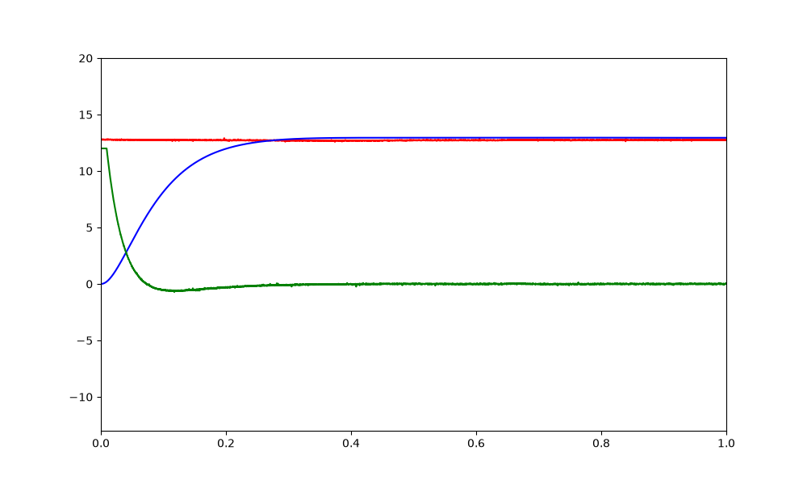

# PID control of a DC motor
This repository implements a PID control over the position of a simulated DC motor. The PID control is implemented in a STM32 Nucleo-64 and the simulated DC motor is implemented in a Python script.

<h3 style="display: inline;">Introduction<h3>

This repository contains the code for a PID position control of a simulated DC motor.

The PID position control is implemented in a C language code that can be run in an STM32 Nucleo-64 board. The board receives via USART the current position of the simulated DC motor anMd compares it with the reference position set by a potentiometer connected to the ADC of the board itself. This difference is the input of the PID controller. The computed control action is sent via USART to the simulated DC motor.

The simulated DC motor is implemeted in a Python code that contains the differential equations that model a DC motor. The control action received via USART updated the status of the motor. After the update, the new motor position is sent back to the Nucleo-64 to start the process again for the next step.
  

<h3 style="display: inline;">Process flow<h3>

The Python code behaves as follows:

1. Initializes the USART communication with the STM32 board
2. Sends the motor position to the STM32 board (at t=0 it is 0 rad)
3. Waits for the STM32 board to communicate the corresponding control action and the current position reference
4. Updates the motor variables according to the received control action
5. Stores the position reference, the current motor position, the control action value and their timestamp
6. Repeat from 2 to 5 until the total number of iterations has been reached. This number is defined by the variable *final_time*
7. After the process has finished, the stored variables are plotted to check the behavior of the DC motor with respect to the position reference

<h3 style="display: inline;">Usage<h3>

First of all, make sure to correct in Python script the Serial Port of the PC where the STM32 board is connected. Otherwise, no communication will exist between the Python script and the STM32 board.

It is very important to start the process with a reset in the Nucleo-64 to initialize the integral and derivative errors. Without a reset, both errors would probably have a value different than zero and would imply in an irregular behavior.

Once the Nucleo-64 has been reseted, the Python script can be executed. Let the program run and wait for the process to finish. At the end of the process, a plot will appear where the behavior of the DC motor and the PID control can be analyzed.

The following parameters can be modified by the user to customize the process:
- Kp, Ki and Kd: proportional, integral and derivative constants. Available in STM32 code
- alpha: low-pass filter for the derivative control to make its effect smoother. Available in STM32 code
- beta: low-pass filter for the whole control action to make it smoother. Available in STM32 code
- DC motor parameters: available in Python code
- final_time: it defines the duration of the simulation (sec. / Ts). Available in Python code

<h3 style="display: inline;">Simulation<h3>

If we run a 1 second simulation with a reference of 13 rad aproximately, we can see in the following image that the PID control makes de motor position reach the reference in less than 300ms:

The response can be tuned by means of changing the PID parameters. A faster response can be achieved by increasing Kp but as a result +12V will be applied to the motor for a longer period. Also, overshoot will probably appear and a change in Kd would be required.

Feel free to play with Kp, Ki and Kd to achieve the desired behavior.